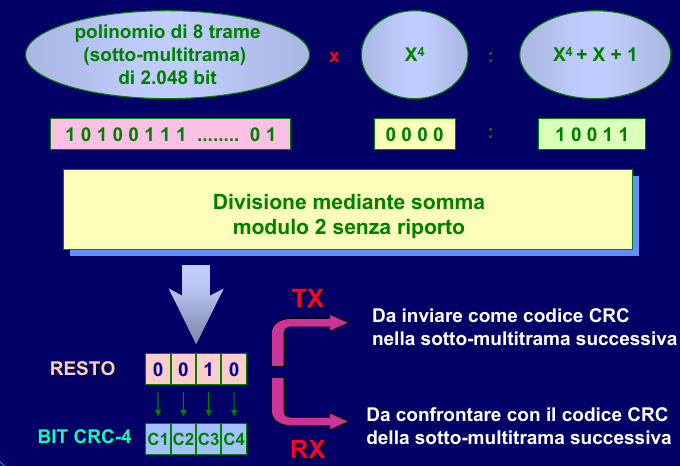

# PDH (Plesiochronous Digital Hierarchy)

## Conversione A/D

- <u>**PCM**</u> (Pulse Code Modulation)
  - consente di convertire un segnale analogico in uno digitale
  - segnale vocale $(300Hz-3400Hz) \rightarrow$ segnale digitale (64 Kb/s)
  - $B=4000Hz$,  $F_c>=2B$  $\rightarrow$ $F_c=8000Hz$,  $T_c=\frac{1}{F_c}=125\mu s$
  - $8000\hspace{0.1cm}campioni/s, \hspace{0.1cm} 8\hspace{0.1cm}bit/campione \rightarrow 64.000 \hspace{0.1cm}bit/s = 64 \hspace{0.1cm} Kb/s$
    - $64 \hspace{0.1cm} Kb/s * 32 \hspace{0.1cm} canali = 2 \hspace{0.1cm} Mb/s$
    - si possono accorpare 30 telefonate (2 canali di servizio) contemporanee usando doppini con banda di 2 Mb/s

## Reti a 2 Mb/s

- I° livello delle gerarchie di multiplazione PDH

- <u>full-duplex</u> - si possono inviare e ricevere dati contemporaneamente
- è <u>rudimentale con basso overhead</u>, infatti non consente:
  - inviare segnalazioni o allarmi significativi
  - calcolare in tempo reale il tasso d'errore
  - una supervisione ed una gestione moderna di una rete
- le linee a 2 Mb/s vengono ancora usate per trasportare 30 linee telefoniche in corrispondenza di uffici di piccole / medie dimensioni

### Multiplazione TDM

- <u>parola</u>: campione di fonia ad 8 bit

- <u>multiplazione TDM</u>:
  - si prende una parola di ogni canale (32 parole di durata $125\mu s$)
  - si accorpano sequenzialmente in un'unica linea numerica ($\frac{125\mu s}{32}=3,9\mu s$ a parola $\rightarrow$ **TIME SLOT**)
  - *fenomeno dello slip*:
    - il multiplatore legge, ad esempio, 9 bit invece di 8
    - il flusso viene shiftato di 1 bit e si perde la comunicazione
  - i 30 canali possono essere usati in multiplazione:
    - deterministica - assegnando ad ognuno di essi una telefonata
    - statistica - la banda dei 30 canali viene gestita in modo dinamico

### Struttura di trama

- ogni trama PCM è suddivisa in <u>32 canali</u> o time slot
  - `1-15` e `17-31` $\rightarrow$ informazione fonica / dati
    - caso trasmissione dati $\rightarrow$ segnalazione utente non necessaria $\rightarrow$ canale 16 disponibile
  - `0` $\rightarrow$ parola di allineamento di trama
    - *trama pari*: `parola A`
    - *trama dispari*: `parola B`
  - `16` $\rightarrow$ segnalazione telefonica (utente)

- <u>allineamento di trama</u>: meccanismo che consente al ricevitore di allinearsi all'inizio della trama e leggere correttamente gli 8 bit di ogni telefonata (evitando lo slip)

### Canale di segnalazione: multitrama

- <u>**multitrama**</u> (16 trame):
  - `T0` $\rightarrow$ parola di allineamento di multitrama
  - `T1` $\rightarrow$ segnalazione canale 1, 16
  - `T2` $\rightarrow$ segnalazione canale 2, 17
  - .... (la segnalazione avviene <u>SEMPRE</u> sul time slot 16 di ogni trama)
- <u>bit di allarme</u> (il protocollo 2 Mb/s ne prevede solo due)
  - **S1** (trasmesso ogni 2 trame)
    - `S1-FAT` (Fuori Allineamento Trama) - sequenza di allineamento non trovata dal ricevitore
    - `S1-MIR` (Mancanza Impulsi in Ricezione) - cavo danneggiato / tranciato
    - `S1-EPAT` (Errore Parola Allinemanento di Trama) - ad ogni PA errata il ricevitore incrementa un contatore; dopo una certa soglia si entra in stato di EPAT
  - **S2** (trasmesso ogni 16 trame)
    - `S2-FAMT` (Fuori Allineamento Multi Trama) - sequenza di multitrama non trovata
    - `S2-MIR64` (Mancanza Impulsi in Ricezione nel canale a 64 Kb/s)

### Strategia di allineamento

- <u>**pallogramma**</u>: algoritmo implementato dal dispositivo ricevente
- <u>stato di FAT</u> - un ricevitore che arriva nello stato di fuori allineamento di trama:
  - butta via tutti i 30 canali informativi (è disallineato)
  - si effettua una <u>ricerca a porta aperta</u>
    - la parola A (trame pari) non viene ricercata ogni 32 time slot ma a partire da un punto qualsiasi della trama
  - se la successiva parola B è errata $\rightarrow$ `R`
    - ritardo di una trama + 1 bit
    - ciò per evitare di incontrare nuovamente una simulazione della parola di allineamento
  - ottenendo una sequenza corretta A-B-A, la trama è considerata allineata

- se il ricevitore si pone in stato di FAT / FAMT manda una segnalazione al mittente con il bit S1 / S2

### CRC (Cyclic Redundancy Check)

#### scopo

- evitare errori
- evitare falsi allineamenti

#### procedimento

- il mittente calcola un <u>check sum</u> sui bit da trasmettere e lo invia al ricevente
- il destinatario effettua lo stesso calcolo e lo confronta con il valore ricevuto

#### struttura della multitrama CRC-4

- suddivisa in due sotto-multitrame (SMF I, SMF II) da 8 trame ciascuna
- il CRC è composto da 4 bit (C1-C4) e viene calcolato per ogni SMF (2048 bit)
  - dopo aver calcolato il CRC di una sotto-multitrama, il mittente lo trasmette nella SMF <u>successiva</u>)
- si utilizza il primo bit della:
  - <u>parola A</u> per memorizzare un bit del CRC
  - <u>parola B</u> per memorizzare:
    - la parola di allineamento della multitrama CRC-4 `001011` (prime 6 trame dispari, serve a notificare il ricevente dell'uso del CRC)
    - due bit `E` per l'indicazione remota di errori CRC-4 (vengono settati a 0 per ogni sotto-multitrama errata)

#### calcolo del CRC-4

#### diagnostica dei collegamenti

- <u>BER</u> - stima dei bit errati in ricezione
- misure di BER utilizzando:
  - <u>bit della PA di trama</u>:
    - 8 bit ogni due trame (7 parola A + 1 parola B)
  - <u>bit del CRC-4</u>:
    - bit della trama coinvolti - tutti
    - probabilità di rilevare errori singoli in una sotto-multitrama - 100%
    - probabilità di rilevare errori multipli in una sotto-multitrama - 75%
- vantaggi del CRC-4:
  - tempo di osservazione (per rilevare guasti) 60 / 70 volte inferiore di quello con bit della PA
  - localizzazione di anomalie e degradi sui flussi con occupazione limitata delle risorse

### Tipi di sincronismi

- <u>tipologie di sincronismi</u> tra due segnali numerici:
  - **isocroni**
    - stessa frequenza
    - sfasamento costante
    - non esistono nella realtà
  - **mesocroni** (*gerarchie SDH*)
    - stessa frequenza (mediamente) $\rightarrow$ massimo sincronismo ottenibile in un sistema reale
    - fase variabile (dipende da impedenza caratteristica del mezzo, distanza, ecc...)
  - **plesiocroni** (*gerarchie PDH*)
    - stessa frequenza nominale
    - frequenze effettive dei multiplatori diverse
    - come funzionavano le reti fino a qualche anno fa
  - **eterocroni**
    - frequenze nominali diverse
- i due tipi di segnale di maggiore interesse pratico sono i segnali ”mesocroni” e quelli “plesiocroni”
- infatti la condizione di perfetto sincronismo <u>non è realizzabile</u> dal punto di vista pratico 
  - segnali trasportati in una rete geograficamente estesa
  - variazioni di fase accumulate lungo i collegamenti tra i nodi della rete

- segnali che nascono sincroni, generati cioè da un unico clock, possono risultare <u>fortemente degradati</u> dal punto di vista delle <u>relazioni di sincronismo</u>, pur mantenendo nel lungo termine la stessa frequenza media
- Pertanto, in una rete numerica sincrona, i segnali che dovrebbero risultare sincroni sono di fatto tra loro <u>mesocroni</u>
