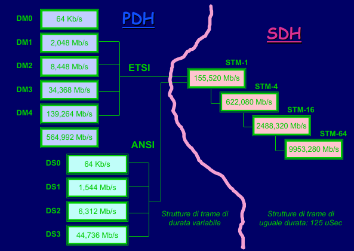
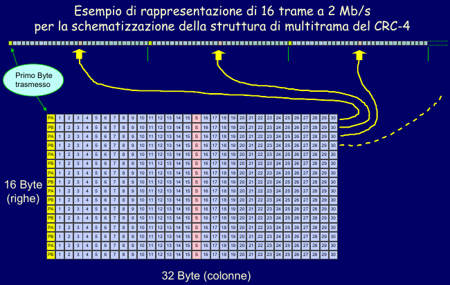
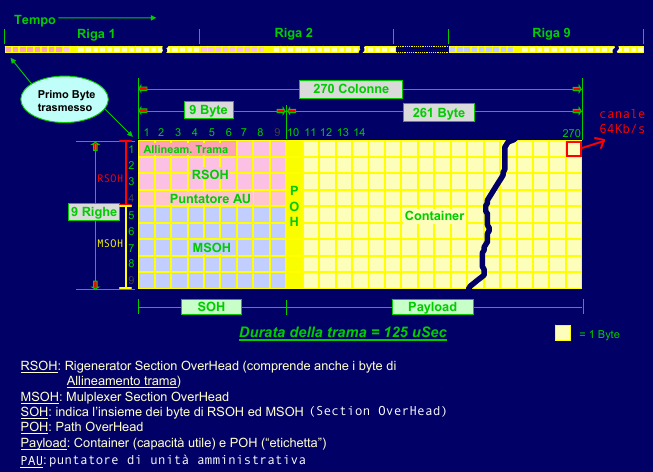
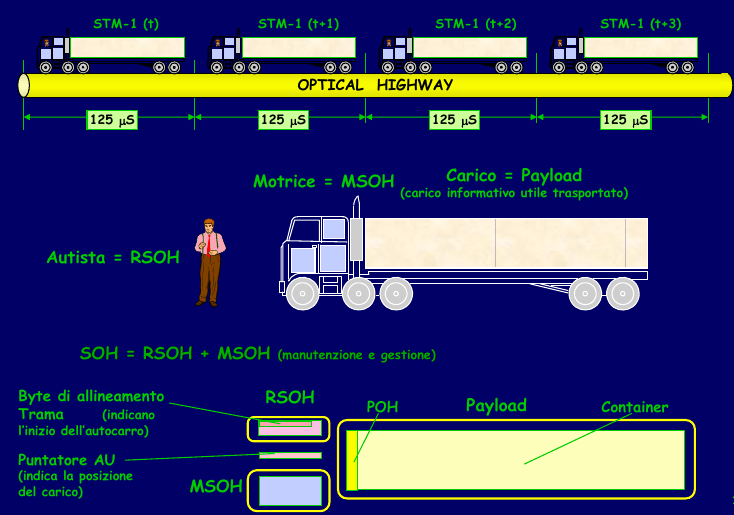
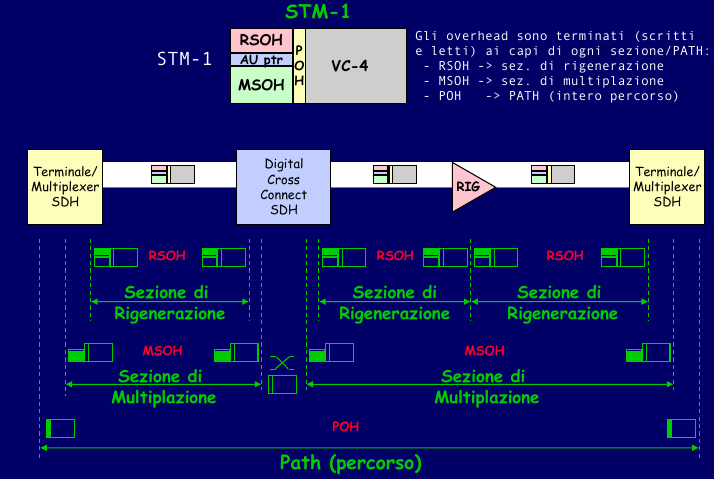
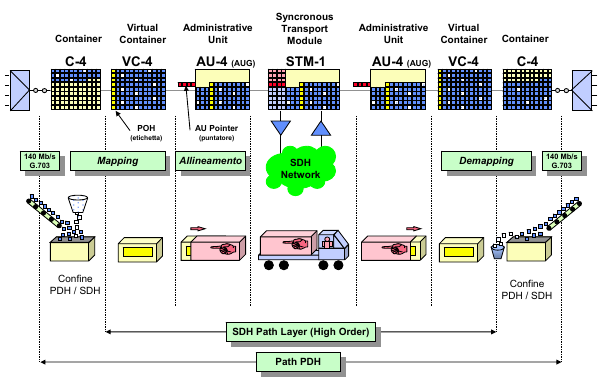
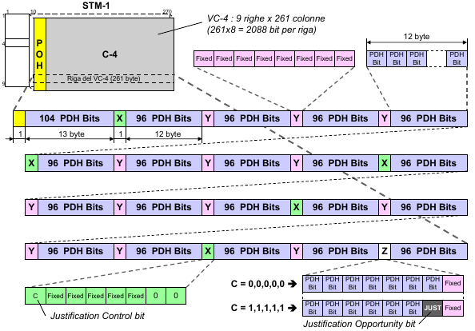
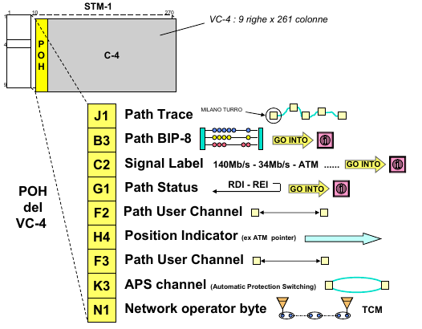

# SDH (Synchronous Digital Hierarchy)

## Confronto gerarchie PDH ed SDH

- **STM** (Synchronous Transport Module): livello gerarchico SDH
  - STM-N $\rightarrow$ multiplazione di N segnali STM-1, N = 1,4,16,64
- **vantaggi rete SDH**:
  - flessibilità della multiplazione:
    - ​	possibilità di <u>multiplare un singolo segnale</u> tributario ad un <u>qualsiasi livello superiore</u> (es: 2 Mb/s in un flusso a 622 Mb/s)
    - <u>accesso diretto ai tributari</u> del segnale multiplato <u>senza step di multi-demultiplazione</u> intermedi (appositi puntatori indicano la posizione del tributario all'interno della trama)
  - protezione, monitoraggio e gestione:
    - <u>5% della trama</u> SDH riservata a <u>byte di overhead</u> per la gestione della rete
    - alta capacità trasmissiva (sistemi ottici)
  - interfacciamento tra apparati di costruttori diversi:
    - integrazione delle due gerarchie PDH europea e americana
    - <u>interfacce standard</u> (SDH standard internazionale)
    - possibilità di connettere <u>apparati di costruttori diversi</u>

## Struttura trama SDH (STM-1)

### Multitrama PDH 2 Mb/s

### Trama SDH STM-1

- caratteristiche principali:
  - trame di durata $125\mu s$ (per qualunque livello gerarchico) <u>trasmesse sequenzialmente</u>
  - ogni ottetto corrisponde ad un canale a 64 Kb/s
    - multiplo intero di 64 Kb/s (permette ad un canale PCM di occupare un time slot)
    - $270 \hspace{0.1cm}colonne\cdot 9 \hspace{0.1cm} righe \cdot 64 \hspace{0.1cm} Kb/s = 155,52 \hspace{0.1cm} Mb/s$
  - suddivisa in:
    - **SOH** (Section OverHead)
      - SOH = RSOH + MSOH
      - funzioni di <u>allineamento trama</u>, <u>monitoraggio degli errori</u>
    - **Puntatore AU** (Puntatore Unità Amministrativa)
      - <u>posizione di inizio dei dati</u> del payload all'interno della trama
    - **Payload** o **VC** (Virtual Container)
      - VC = POH + Container (canali utenti disponibili)
      - il payload può essere completamente o parzialmente riempito in base alla quantità di traffico utente
      - <u>Es</u>: spedizione di un pacco
        - POH $\rightarrow$ etichetta con indirizzo di mittente e destinatario
        - container $\rightarrow$ scatola contenente il pacco
  - <u>overhead totale</u> = SOH + POH = 90 byte

### Overhead di trasporto

- rete di trasporto SDH:
  - livello di percorso (**PATH**)
    - connessione logica tra due punti della rete
    - indipendente da tipo di servizio o mezzo trasmissivo
    - <u>POH</u> (Path OverHead)
      - stabilisce il percorso dalla centrale di trasmissione a quella di ricezione
      - contiene informazioni sulla sorgente e sulla destinazione del VC
  - livello di sezione (section)
    - sezione di rigenerazione $\rightarrow$ <u>RSOH</u> (Rigenerator Section OverHead)
    - sezione di multiplazione $\rightarrow$ <u>MSOH</u> (Mutiplexer Section OverHead)

### Trasporto del PDH nell'SDH

1. <u>creazione di un container</u> (C-4) composto da:
   - bit informativi
   - bit di riempimento (PDH 140 Mb/s $\rightarrow$ container STM-1 149 Mb/s)
   - bit di stuffing variabili (flusso PDH asincrono $\rightarrow$ serve una certa tolleranza)
2. <u>apposizione dell'etichetta</u> (POH) $\rightarrow$ virtual container (VC-4)
3. posizionamento del VC all'interno del payload di una trama STM-1:
   - <u>posizionamento casuale</u> (viene scritto dal primo istante utile)
   - spesso i VC vengono spezzati su <u>due trame successive</u>
   - **AU-4** (unità amministrativa) $\rightarrow$ puntatore alla posizione di inizio del VC
4. <u>scrittura del SOH</u> (RSOH + MSOH) $\rightarrow$ trama STM-1
5. trasporto della trama lungo la rete sincrona SDH
6. la centrale di ricezione svolge le operazioni inverse:
   - lettura del SOH e dell'AU
   - ricostruzione del VC
   - lettura del POH ed estrazione del container
   - eliminazione dei bit di stuffing
   - riottenimento del flusso PDH a 140 Mb/s

#### Mapping all'interno del VC

- bit di tributario $\rightarrow$ occupano i PDH bits disponibili
- adattamento al segnale di clock asincrono $\rightarrow$ <u>giustificazione</u>
  - in ogni riga del container (9 in totale) sono presenti:
    - <u>140 bit fissi di riempimento</u> (byte Y + quelli nei byte X, Z)
    - <u>1 bit di giustificazione positiva</u> `JUST` (*Justification Opportunity Bit*) in Z
    - <u>5 bit di controllo giustificazione</u> `C` (*Justification Control Bit*), uno in ogni X
      - C = 0,0,0,0,0 $\rightarrow$ JUST bit di tributario
      - C = 1,1,1,1,1 $\rightarrow$ JUST bit di stuffing

#### Byte del POH

- **J1** (Path Trace)
  - primo byte del VC
  - viene puntato dall'AU
- **G1** (Path Status)
  - funzione di trasferimento di allarme
  - segnalazione di guasti, tasso d'errore eccessivo
- **H4** (Position Indicator)
  - puntatore al primo PDU trasportato dentro il container
- **K3** (Automatic Protection Switching channel)
  - devia automaticamente il traffico su risorse di rete di riserva in caso di guasti

#### Bit di parità

- **BIP-(n,m)**
  - n - bit che esprimono il risultato (n = 8)
  - m - byte sul quale calcolare il BIP
- il risultato viene inserito nel byte B3 del POH del VC-4 successivo
- si ottiene una <u>stima del tasso di errore</u> sul VC

