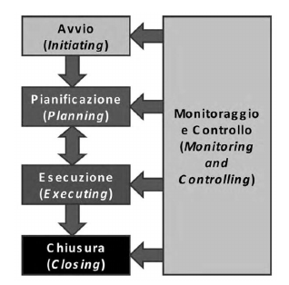

# Introduzione al Project Management

## Definizioni

- **progetto**
  - deve essere <u>temporaneo</u>
    - le attività quotidiane di un'organizzazione non sono progetti
    - ha un inizio e una fine
  - deve essere <u>univoco</u>
    - non è ripetibile
  - <u>scopo</u>: creare qualcosa:
    - prodotto (es: sistema informatico)
    - servizio (es: call center)
    - risultato (es: risultato di uno studio)
  - può essere:
    - interno 
      - utile ai fini aziendali
    - esterno
      - anche detti <u>commesse</u>
      -  nascono dall'esigenza di un cliente
      - possono essere commissionati ad un'altra azienda  (mantenendo una <u>supervisione interna</u>)
  - nascita di un progetto
    - quando <u>nasce un'idea</u> (filosofico)
    - quando è stato <u>selezionata ed approvato dall'azienda</u> e si è tenuto un *kickoff-meeting* (riunione iniziale tra i partner che segna ufficialmente l'inizio del progetto)
- **project management**
  - insieme delle attività che si conducono per portare avanti un progetto
  - project vs design
    - **project** - gestione del progetto lato <u>gestionale</u> (*progetto*)
    - **design** - gestione del progetto lato <u>tecnico</u> (*progettazione*)
  - <u>gruppi di processi</u> (macro fasi) di gestione di un progetto (alcuni in parallelo tra loro)
    - avvio
    - pianificazione
    - esecuzione
    - monitoraggio e controllo
    - chiusura
  - attività gestionali
    - identificazione dei requisiti (*requirements*)
    - analisi delle esigenze, aspettative degli stakeholders
    - definizione e perseguimento degli obbiettivi
    - determinazione dei vincoli di progetto:
      - ambito (*scope*)
      - tempi (*schedule*)
      - qualità (*quality*)
      - costi (*cost*)
      - risorse (*resources*)
      - rischi (*risk*)
- **programma**
  - gruppo di progetti tra loro correlati
    - possono condividere delle risorse
    - la correlazione influisce su tempi, cosi
  - <u>program manager</u>
    - responsabile di un programma
    - PM con qualche anno di esperienza
- **portfolio**
  - <u>insieme di progetti e programmi</u>, anche non correlati, gestiti da un'azienda per raggiungere gli obbietivi strategici di business
  - implica un alto budget
  - gestito da un <u>top manager</u> aziendale
- **lavoro operativo** (Operational Work)
  - <u>attività ripetitive</u> eseguite dalle <u>unità operative</u> (singoli individui del team)
  - al contrario di un progetto:
    - è <u>ripetitivo</u>
    - <u>non ha fine</u>

## Project Management Organizzativo

- **PMO**  (Project Management Office)
  - serve a tenere memoria dei progetti passati
  - si possono riutilizzare best practice e parti di un vecchio progetto
  - attività di supporto al project management

## Ciclo di vita di un progetto

- insieme delle <u>fasi tecniche</u> in cui un progetto è diviso
- famiglie
  - **predittivi**
    - simili ai cicli plan-based (<u>pianificazione totale</u> prima dell'implementazione)
    - usati nei progetti di costruzione ed impiantistica
  - **iterativi e incrementali**
    - pianificazione ed implementazione di parti del progetto per volta
    - ci sono <u>più iterazioni</u> (planning + implementation)
    - in ogni iterazione si realizza una parte del progetto che viene realizzato in <u>modo incrementale</u>
    - molto comune nei progetti ICT
  - **adattivi**
    - <u>metodologie Agile</u>
    - utilizza cicli iterativi e incrementali di <u>durata molto breve</u> e <u>fissa</u> (2-3 settimane)
    - in ogni iterazione si porta avanti una piccola parte del progetto
    - requisiti ed ambito vengono definiti con il passare delle iterazioni
    - adatto per progetti con cambiamenti frequenti di piccole/medie dimensioni
  - **ibridi**
    - combinazione di ciclio predittivi e adattivi
- ciclo di vita del prodotto
  - più lungo di quello del progetto
  - include:
    - <u>fasi di manutenzione</u> del prodotto
    - progetti per generare <u>nuove versioni</u> di esso
  - termina quando il prodotto viene dismesso

## Fasi del progetto

- ogni progetto viene <u>suddiviso in fasi</u>
- possibilità di fare un controllo al termine di ognuna (ritardi, consumi)
- possono essere <u>parzialmente sovrapposte</u> o <u>parallele</u>

## Processi

- <u>serie di attività</u> condotte del team di progetto atte a <u>raggiungere un risultato</u>
- associati ad un <u>gruppo</u> e ad un'<u>area di conoscenza</u>
- tipologie
  - <u>project management</u> (gestionali)
  - <u>orientati al prodotto</u> (tecnici)
  - (parte tecnica e gestionale si sovrappongono spesso)

### Gruppi di processo (Process Group)

- <u>gruppi di processo</u> (macro fasi)
  - avvio (*initiating*)
  - pianificazione (*planning*)
  - esecuzione (*executing*)
  - monitoraggio e controllo (*monitoring & controlling*)
  - chiusura (*closing*)

### Aree di conoscenza (Knowledges Areas)

- **integrazione** (*integration*)
  - assicura che elementi, tematiche e stakeholders siano coordinati e integrati
  - definisce il <u>Project Management Plan</u>
- **ambito** (*scope*)
  - stabilisce il <u>confine del progetto</u> (cosa è dentro e cosa è fuori)
  - definisce:
    - <u>Scope Management Plan</u>
    - <u>Scope Baseline</u>

- **schedulazione** (*schedule*)
  - gestione dei tempi (terminare il progetto nei tempi previsti)
  - definisce:
    - <u>Schedule Management Plan</u>
    - <u>Schedule Baseline</u>
- **costi** (*cost*)
  - monitoraggio e gestione del budget
- **risorse** (*resource*)
  - gestione risorse umane, materiali e immateriali
- **qualità **(*quality*)
  - norme sulla qualità
- **rischi** (*risk*)
- **comunicazione **(*communications*)
- **approvigionamenti** (*procurement*)
  - redigere contratti di approvigionamento
- **stakeholder** (*stakeholders*)

### Processi per area di conoscenza

- ad ogni area sono associati diversi processi
  - il primo processo di ogni area riguarda la <u>pianificazione</u> della stessa
  - l'ultimo riguardo il <u>controllo</u> dell'area
- *tecniche di project management* -> tabella di 10 righe e 5 colonne, dove:
  - **colonne** - <u>gruppi di processo</u> (macro fasi)
  - **righe** - <u>aree di conoscenza</u> (problematiche che il PM deve considerare)
- lavoreremo prima per righe e successivamente per colonne

## Dati del progetto

- il PM ha bisogno di dati/informazioni per svolgere il suo lavoro (spese, tempi, costi)
- i dati devono essere elaborati, aggregati per estrarre delle informazioni
- **dato** - informazione grezza
- **informazione** - viene estratta combinando i dati
- **SAL** (Stato Avanzamento Lavori)
  - fine di un pezzo di un progetto
  - revisione degli obbiettivi
  - ad ogni SAL, se il cliente è soddisfatto, paga una parte del progetto

## Personalizzazione dei progetti

- PMI è uno standard che fornisce una struttura di base per operare
- progetti di tipologie diverse richiedono una personalizzazione del project management
  - regole aziendali
  - template da seguire

## Documenti aziendali di business

- **business case**
  - documento in cui si fa uno studio della situazione e dei possibili benefici che il progetto può apportare
  - serve a capire se il progetto ha senso o meno
  - <u>risultato di uno studio di fattibilità</u>
  - si realizza per:
    - domanda di mercato
    - opportunità strategica / nuovo business (*anticipare il mercato*)
    - bisogni sociali (*costruzione di un parco giochi*)
    - fattori ambientali (*ampliamento aree pedonali*)
    - richiesta di un cliente
    - avanzamento tecnologico
    - richieste legali (*nuove regole sulla sicurezza*)
- **piano di gestione dei benefici di progetto**
  - identifica e specifica come fruire dei benefici del progetto
  - definisce <u>KPI</u> (Key Performance Indicator) del progetto
  - i benefici generalmente si ottengono solo al termine del progetto, questo piano stabilisce come misurarli

## Successo di un progetto

- non misurabile solo in termini di guadagno percepito
- un progetto è finito rispettando gli ambiti, i costi ed i tempi
- è stato rispettato il piano di gestione dei benefici
- si può misurare con dei KPI
  - NPV (Net Present Value)
  - ROI (Return On Investment)
  - IRR (Internal Rate of Return)
  - PBP (Payback Period)
  - BCR (Benefit-Cost Ratio)
- rispetto dei termini contrattuali
- soddisfacimento degli obbiettivi strategici
- soddisfacimento degli interessi degli stakeholders

- screen slide 46

## Fattori ambientali e contesto di progetto

- il contesto incide fortemente sul progetto
- il contesto dipende da:
  -  cultura, struttura e governance dell’organizzazione;
  - risorse esistenti e loro distribuzione geografica;
  - infrastrutture, ovvero attrezzature ed equipaggiamenti (Facilities and Capital Equipment)
  - il sistema informativo di Project Management (PMIS – Project Management Information System) che si è deciso di usare (o che il
    cliente haimposto di usare) per il progetto, visto come collezione di competenze, procedure e strumenti informatici orientati alla
    gestione del progetto
  - politiche di gestione delle risorse umane e di altre risorse
  - capacità, esperienze e competenze del personale di progetto
  - politiche di sicurezza e protezione dei dati sensibili
  - condizioni di mercato (Marketplace Conditions)
  - cultura e valori del paese dove si svolge il progetto
  - tolleranza al rischio degli stakeholder (soprattutto il management e il cliente)
  - database commerciali
  - ricerca accademica
  - standard e regolamentazioni di legge o di settore
  - caratteristiche dell’ambiente fisico

## Asset di un'azienda

- tutte le <u>risorse di valore</u> disponibili nell'organizzazione utilizzate ai fini di successo del progetto (es: PMO)
- categorie
  - processi e procedure
    - ...
    - templates
  - conoscenza base dell'organizzazione

## Obbiettivi strategici

- un progetto nasce nell'ambito della <u>strategia aziendale</u>
- portfolio -> programma -> progetti

## Strutture organizzative aziendali

- **semplice** (Organic or Simple Organization)
  - tipica di contesti familiari
  - assenza di ruoli precisi
  - PM part time senza incarico formale
  - difficilmente nascono progetti
  
- **funzionale** (Functional Organization)
  - concentrata sulle specializzazioni
  - ogni funzione esegue il suo lavoro indipendentemente dalle altre
  - possono nascere progetti, ma più che al PM si risponde direttamente alla divisione
  
  
  
- **a matrice** (Matrix Organization)

- **matrice debole** (Weak Matrix)
  - pur prevedendo un team di progetto, è poco orientata alla gestione dei progetti
  - i team member rispondono a pieno al manager funzionale
  - autorità minima del PM
  
- **matrice bilanciata** (Balanced Matrix)
  - il PM ha lo stesso peso dei manager funzionali
  - possono sorgere problemi in caso di conflitto tra le due figure
  
- **matrice forte** (Strong Matrix)
  - il PM ha più potere dei manager divisionali
  
- **per progetti** (Projectized Organization)
  - le divisioni contano poco, l'importanza va ai progetti
  - il PM risponde solo al top manager
  
- **virtuale** (Virtual Organization)
  - gruppi di progetto (anche di aziende diverse) che lavorano virtualmente sullo stesso progetto attraverso piattaforme online (teams, zoom)
  
- **ibrida** (Hybrid Organization)
  - mescolanza delle caratteristiche delle organizzazioni descritte
  
- **con PMO** (PMO Organization)
  - tiene tutte le lezioni apprese
  - organizza i gruppi
  - funge da collante per le esigenze dei vari progetti