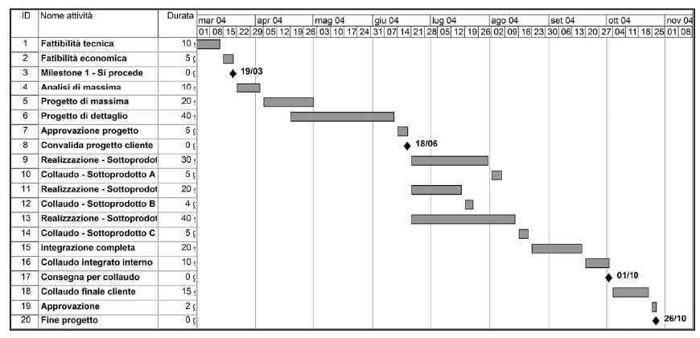
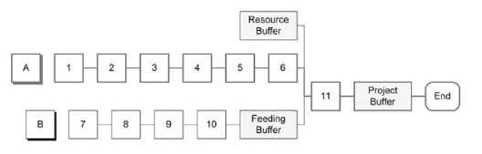

# Gestione della schedulazione del Progetto

## Processo Estimate Activity Durations

- **metodo votazione Fist of Five**
  - consente di prendere decisioni attraverso una discussione seguita da una votazione (es: slittare un'attività)
    - 0 dita -> totalmente in disaccordo
    - 5 dita -> totalmente d'accordo
  - in caso di alcuni 0,1,2 si cerca di discutere con gli interessati, magari riformulando la proposta con alcuni cambiamenti
- **stima durata attività**
  - **stima per analogia**
    - si vede cosa è successo per un'attività simile per il passato
    - si rivedono le *lesson learned*
    - <u>Pro</u>: veloce, poco costa
    - <u>Con</u>: Approssimativa (ogni lavoro ha delle paculiarità)
  - **stima parametrica**
    - utilizzando quando ho dei dati storici consolidati
    - <u>Pro</u>: più precisa
    - <u>Con</u>: più impegnativa (mi servono dei dati oggettivi)
  - **stima statistica**
    - invece di avere un valore esatto, punto ad ottenere una stima
    - basata su:
      - durata più probabile
      - durata ottimistica
      - durata pessimistica
    - si può poi usare una distribuzione:
      - triangolare (media dei valori)
      - beta (il valore centrale ha un peso maggiore)
    - accanto alla media si ha la varianza (o deviazione standard)
    - <u>Pro</u>: più completa (ho sia una stima che di quanto può variare)
    - <u>Con</u>: lenta e più complessa (molti conti da fare)

## Processo Develop Schedule

- abbiamo determinato la durata delle attività, ma non le abbiamo inserite in un asse temporale
- alcune attività potranno andare in parallelo, altre devono essere sequenziali
- **obbiettivo**: stabilire l'inizio e la fine di ogni attività nel tempo

- **forma riepilogativa**

  - tabella

    - es: data inizio e fine
    - poco amichevole come rappresentazione

  - grafica

    - reticolo di schedulazione del progetto

      - riproduce il metodo PDM (un nodo per ogni attività, le frecce indicano le dipendenze)
      - visualizzazione grafica del PDM, aggiunge più info
        - nodi -> palline
        - tabelle con informazioni sull'attività

    - diagramma a barre (di Gantt)

      -  una riga per ogni attività
      - le colonne sono i tempi
      - le barre orizzonali indicano quando e per quanto durerà un'attività

      

    - diagramma delle milestone

      - non metto tutte le attività ma solo le milestone
      - preferibile non usarlo

- **baseline della schedulazione** (PCM)

- studio del diagramma di Gantt / reticolo

  - serve per individuare e prevenire delle criticità, ovvero attività che mi fanno sforare / portare al limite i tempi di progetto

  - metodi per individuare le criticità

    - **metodo del percorso critico**

      - partendo dalla data di inizio, iniziamo a mettere tutte le attività
      - contiamo inizialmente che tutte le attività rispettino i tempi previsti
      - la data di fine dell'ultima attività indica la data di fine progetto ideale, deve essere inferiore alla reale data di fine progetto (non considero nessun ritardo)
      - successivamente lavoro all'indietro:
        - punto a finire dopo
        - mi chiedo qual è la data <u>ultima</u> per iniziare il progetto
        - <u>TF</u>: margine della singola attività
      - **scorrimento libero**
        - spostando una singola attività se ne sposteranno a catenna delle altre
        - <u>FF</u> (*Free Float*) indica di quanto può ritardare la fine di un'attività senza condizionare l'inizio delle attività successive
      - criticità delle attività tramite TF:
        - `TF > 0` -> attività non critiche (ho un certo margine di scorrimento)
        - `TF = 0` -> attività critiche (non ho scorrimento)
        - `TF < 0` -> attività iper-critiche (non è possibile terminare il progetto nel tempo stimato)
      - **percorso critico**: insieme delle attività critiche

    - **metodo della catena critica** (CCM)

      - nel CPM si considerano risorse non limitate (caso ideale)

      - CCM metodo a <u>risorse limitate</u>

      - lavoro a ritroso tramite <u>buffer</u>

        - tempi morti di riserva inseriti in determinati punti per evitare di sforare la fine del progetto

      - procedimento:

        - **Project Buffer**: protegge la data di fine progetto

        - **Feeding Buffer**: protegge la <u>catena critica</u>

          - catena che abbraccia tutte le attività critiche

        - **Resource Buffer**: protegge attività con risorse potenzialmente sovraccariche (condivise, es: grafico)

          

          - invece di inserire un buffer per ogni attività (statisticamente improbabile che ritardino tutte) ne metto uno unico alla fine

  - tecniche di ottimizzazione delle risorse

    - casi in cui, dopo le stime, i buffer allocabili sono pochi (<u>tempo stimato non sufficiente</u>)
    - se non si possono dilatare i tempi bisognerebbe:
      - aumentare le risorse
      - rifiutare alcune attività (ridiscutere il progetto)
      - abbassare la qualità del progetto per ridurre tempi/costi delle attività

  - tecniche di compressione della schedulazione

    - aggiungere risorse (non sempre possibile)
    - parallelizzare alcune attività
      - alcune possono essere parzialmente sequenziali
      - es: finita una al 75% potrei iniziare l'altra

## Processo Control Schedule

- monitoraggio continuo dei tempi
- dobbiamo passo passo (ad ogni milestone) controllare i tempi per evitare di sforare e, in caso, prevedere un piano di rientro

