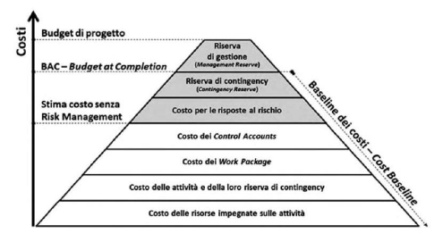
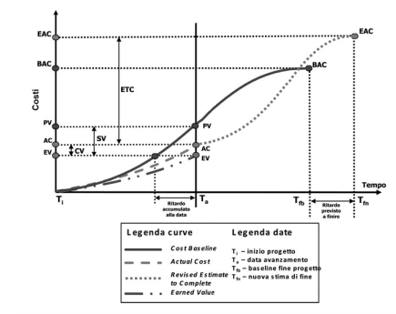

# Gestione dei costi del Progetto

## Introduzione

- baseline
  - scopo
  - tempo
  - costo
- gestione dei costi improvvisata
  - è complicato
  - difficili da gestire
    - vari modi di pagare e rendicontare in base alle aziende
    - alcuni costi non sono imputabili al singolo progetto (es: affitto delle sede aziendale in cui si lavora a più progetti)
    - PMI non consiglia una gestione puntuale (si aspetta finchè si hanno concretamente i soldi), ma il PM dovrebbe redigere un resoconto informale di natura extracontabile
- costi di un progetto
  - risorse umane
  - non umane (materiali, attrezzatura, servizi, strutture)
  - particolari (accantonamento per inflazione)
  - contingenza (legato ai rischi)
  - qualità (dipende dalla qualità dei beni/servizi)
- processi di gestione dei costi:
  - **pianificazione**
    - definire una serie di regole sui costi
  - **stima dei costi** (estimate costs)
    - piano di gestione dei costi
      - definisce le regole per l'aspetto economico del progetto
  - **determinazione del budget**
  - **controllo dei costi**
- **life-cycle costing**: costo progetto + relativa manutenzione (10%-30% del costo di progetto)

## Processo Estimate Costs

- verifica del costo di ciascuna attività
- integrando i costi si ottiene il costo del WP e del progetto
- la stima è <u>iterativa</u> (specialmente lavorando in Agile), mano a mano che il progetto progredisce la stima è più accurata
  - dipende generalmente da una valuta
  - per alcuni ambiti si possono usare altre unità (es: ore uomo)
- <u>gestione approvigionamenti</u>: analisi **Make-or-Buy** / **Make-or-Lease**
  - devo comprare / affittare un bene (mandare in out-sourcing)
    - *near-sourcing*: out-sourcing fatto con una catena di approvigionamento breve (es: paesi più vicini a noi)
  - devo creare l'oggetto internamente
- suddivisione costi:
  - fissi / variabili
    - <u>fissi</u>: indipendenti dalla quantità di risorse che si usa
    - <u>variabili</u>: derivano dall'uso delle risorse (più si usano e più si alzano i costi relativi)
  - diretti / indiretti
    - <u>diretti</u>: dipendono dall'impiego di risorse sul progetto (es: stipendio risorsa umana, acquisto apparecchiatura)
    - <u>indiretti</u>: non dipendono direttamente dal lavoro svolto nel progetto, ma che può essere allocato nel progetto (es: costo energia elettrica dello stabile in cui si sta sviluppando il progetto)
- più si è precisi nella definizione dell'ambito, più si sarà precisi nella stima dei costi (strettamente legati ai processi Project Scope Management)
- input per stimare costi:
  - <u>piano gestione dei costi</u> - regole per la gestione dei costi
  - <u>piano gestione della qualità</u> - fornisce il costo della qualità
  - <u>baseline dell'ambito</u> - 
  - <u>lessons learned</u> - es: stima per analogia
  - <u>schedulazione</u> - devo capire in che periodo utilizzare certe risorse
  - <u>requisiti delle risorse</u> - caratteristiche e quantità delle risorse variano i costi
  - <u>registro dei rischi</u> - la stima dei costi deve prendere in considerazione le informazioni relative alle risposte ai rischi
    - un rischio non porta sempre a cose negative
    - si suddividono in minacce e opportunità
- **intervallo di confidenza**
  - avendo a che fare con una stima dei costi bisogna fornire un <u>livello di incertezza</u>
  - tale livello si riduce mano a mano che l'attività da svolgere si avvicina temporalmente (ottimale: 5% - 10%)
- strumenti per stimare i costi
  - **stima per analogia**
    - usata quando si hanno <u>poche informazioni</u> sul progetto
    - si prende come modello un <u>progetto simile</u> svolto in passato
    - chiamata anche stima <u>top-down</u> (prima si da una stima complessiva, successivamente si percorre tutta la WBS per dare un costo a ciascuna attività)
    - Pro: poco costosa
    - Con: poco accurata
  - **stima parametrica**
    - basata su <u>parametri quantificabili</u>
    - stima <u>bottom-up</u> (più facile partire dal basso e risalire verso la radice)
  - **stima statistica**
    - si calcolano caso ottimo, pessimo e più probabile
      - costo atteso -> distribuzione triangolare / beta
      - varianza / deviazione standard
- **costo della qualità**
  - maggiore è la qualità dei prodotti, più il costo sale
  - per essere competitivi in alcuni mercati bisogna rispettare degli standard minimi di qualità
  - prevenzione costa meno dei danni successivi derivanti dalla bassa qualità dei prodotti
- **riserve**
  - contingenza
    - legata ai rischi noti
    - fa parte del budget del PM (è gestita in autonomia da lui)
    - 10% del budget
  - gestione
    - legati a rischi non noti
    - non fa parte formalmente del budget (il PM può usarli solo dopo aver dimostrato all'executive che quei rischi non erano noti a priori)
    - è considerata extra-budget perchè il PM non può usarla direttamente ma deve richiedere l'autorizzazione
    - 5% del budget
- **basi delle stime**
  - documentazione riguardante le basi su cui è stata fatta la stima
  - può riguardare:
    - modo di valorizzare la stima
    - assunti e vincoli su cui è basata la stima
    - rischi identificati
    - intervallo delle stime
    - livello di affidabilità

## Processo Determine Budget

- **budget**

  - quantità a disposizione del PM (= tutti i costi + riserve di contingenza)

  - oltre ai costi bisogna definire le <u>spese nel tempo</u>

    

    - la tipica forma dei costi è ad "S"
    - salgono nella parte iniziale del progetto e tendono a diminuire verso la fine
    - mano a mano che si conoscono meglio i costi, la curva tende a cambiare leggermente (in caso di modifiche pesanti bisogna rifarla)

- **BAC** (Budget at Completion) - costo finale del progetto

- **PV** (Planned Value) - costo previsto per una certa data

  - il PV evolve nel tempo
  - dovrebbe tendere infine al BAC

- cash flow = soldi SAL - valore curva ad S

  

  - ad ogni SAL si richiede una percentuale monetaria
  - questo grafico aiuta a capire se e quando l'azienda dovrà anticipare dei soldi
  - il cash flow può essere negativo:
    - ho previsto un periodo di spese che riuscirò a sostenere con alcune riserve (es: il cliente non può pagare immediatamente)
    - ho sbagliato i conti

- Budget di progetto = BAC + riserva di gestione

  

## Processo Control Costs

- non controllare i costi porta alla deriva economica del progetto

- verificare e misurare eventuali scostamenti economici e prevedere un <u>piano di rientro</u>

- attività principali

  - rilevazione dei consuntivi economici (costi effettivi)
  - controllo andamento costi
  - valutazione degli scostamenti economici rispetto a quanto previsto
  - ricerca delle cause che li hanno provocati (sia positivi che negativi)
    - se la causa del passato si ripercuote sul futuro (es: aumento costo energia) bisognerà riadattare tutti i costi
  - analisi delle stime al completamento
  - adozione di azioni correttive per mantenere i costi entro limiti accettabili
  - analisi di impatto economico delle modifiche richieste
  - gstione della riserva di contingenza
  - gestione e divulgazione delle eventuali modifiche autorizzate al budget e alla Cost Baseline
    - le precedenti baseline non dovrebbero essere mai cancellate, ma sempre tenute nell’archivio dei documenti di
      progetto

- **metodo EVM** (Earned Value Method)

  - valutazione integrata in termini di tempi, costi e performance in approccio misto tra pianificato e consuntivo

  - valuta per ogni attività:

    - **PV** (Planned Value) - preventivo del lavoro alla data attuale
    - **EV** (Earned Value) - valore a preventivo del lavoro effettivamente svolto alla data attuale
      - dipendente da quanto si è effettivamente realizzato
    - **AC** (Actual Cost) - quanto effettivamente speso alla data attuale
      - può essere maggiore o inferiore al PV

  - possono capitare quattro casistiche:

    - spendere meno, realizzare meno
    - spendere meno, realizzare di più
    - spendere di più, realizzare di meno,
    - spendere di più, realizzare di più

  - il PM deve agire per gestirle opportunamente

  - calcolo del PV

    - cercarlo sulla curva dei costi
    - mettere la data di oggi nella ascissa
    - leggere il valore intersecato nelle ordinate

    

  - calcolo EV (singola attività)
    - verificare la produzione alla data di oggi
    - percentuale avanzamento attività * budget attività
  - calcolo AC
    - non semplice perchè il costo effettivo speso per un progetto può essere:
      - costo contabilizzato
      - costo impegnato
      - costo speso (sostenuto)
    - ipoteticamente bisognerebbe considerare il costo sostenuto, ma potrebbe arrivare tanto in ritardo
    - bisognerebbe segnarsi i costi impegnati in un foglio di calcolo e considerare quelli ai fini dell'AC

- **misure sulle prestazioni**

  - CV (Cost Variance) - di quanto sono variati i costi rispetto alle previsioni
    - esprime in valore assoluto il deficit economico (se negativo) o il surplus (se positivo)
    - $ CV=EV-AC $ (quanto ho realizzato - quanto ho speso)
    - CV > 0 -> ho realizzato più di quanto ho speso
    - CV = 0 -> perfetto
    - CV < 0 -> ho speso più di quanto ho realizzato
  - CPI (Cost Performance Index)
    - $CPI=\frac{EV}{AC}$

  - SV (Schedule Variance) - 
    - indice di efficenza dei tempi
    - $SV=EV-PV$
    - indice se sono avanti con i tempi o meno
    - SV > 0 -> ho realizzato più di quanto preventivato
    - SV = 0 -> sono in linea con i tempi
    - SV < 0 -> sono in ritardo con i tempi
  - SPI (Schedule Performance Index)
    - $SPI=\frac{EV}{PV}$
  - Esprimibili anche in %

- Casi particolari

  -  CV negativo o CPI < 1.0 indica maggior costo rispetto a quanto prodotto e quindi una tendenza del progetto a spendere di più;
  - CV positivo o CPI > 1.0 indica minor costo rispetto a quanto prodotto e quindi una tendenza del progetto a spendere di meno;
  - SV negativo o SPI < 1.0 indica minore valore prodotto rispetto a quanto stimato e quindi una tendenza al ritardo;
  - SV positivo o SPI > 1.0 indica maggiore valore prodotto rispetto a quanto stimato e quindi una tendenza all’anticipo.

- **Trend Analysis**: tenendo traccia dei valori nel tempo si mette in risalto l'evoluzione della tendenza

- Previsioni future:

  - **BAC** -> budget inizialmente preventivato
  - **EAC** -> stima per il futuro alla data di oggi
  - stima del budget per completare il progetto

  - **VAC** = EAC - BAC
    - scostamento di bilancio
    - quanto devo spendere in più rispetto al BAC per completare il progetto

  - **ETC** -> costo stimato residuo del progetto alla data attuale
    - EAC = AC + ETC (costo speso fino ad ora + previsione di spesa futura)