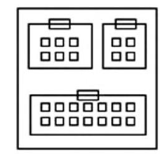
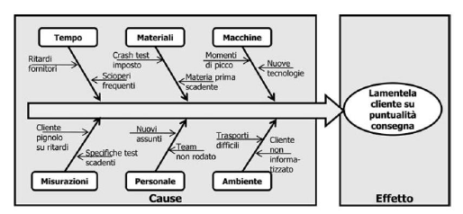
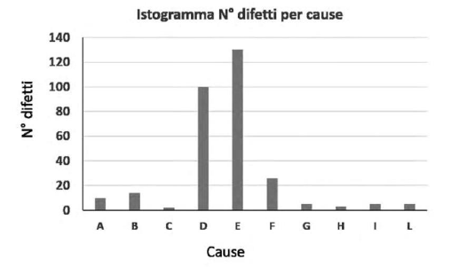
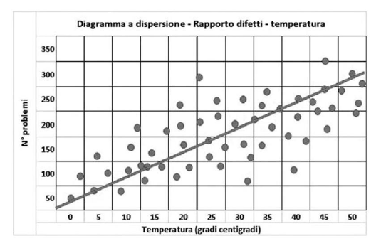
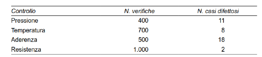
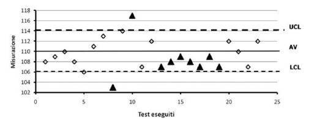
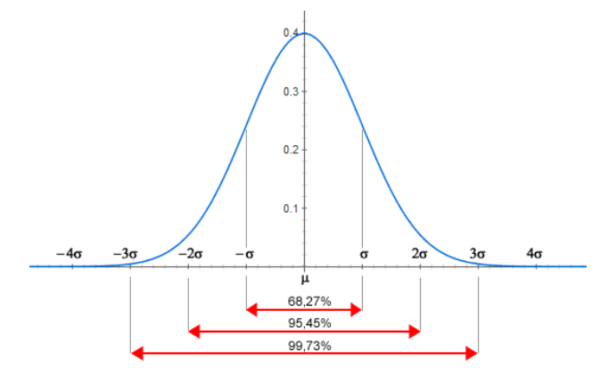
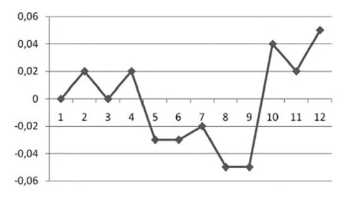
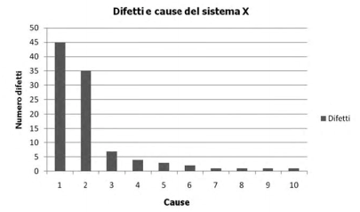

# Gestione della qualità del Progetto

## Processo Plan Quality Management

### Costo della qualità

- garantire un certo livello di qualità del prodotto e del processo ha dei costi
- <u>valutazione costi-benefici</u>
  - i costi sono facilmente visibili
  - i benefici più difficilmente (es: possibile richiamo di un prodotto per una non conformità)
- suddivisi in:
  - <u>costi di conformità</u> - necessari per prevenzione e valutazione/ispezione di qualità
    - **prevenzione**: realizzare un prodotto di qualità costa 
    - **valutazione della qualità**: (es: costo macchina per crash test)
  - <u>costi di non conformità</u> - sostenuti per rimediare al mancato rispetto dei requisiti o di possibili malfunzionamenti
- benefici
  - minore rilavorazione (richiamo, riparazione, manutenzione)
  - migliore produttività
  - maggiore soddisfazione stakeholder
- il valore di qualità a cui puntare varia in base all'obbiettivo, budget a disposizione e al tipo di prodotto (per alcuni non ha senso spendere eccessivamente in qualità)
- il piano di gestione della qualità deve essere rapportato alla strategia aziendale adottata

## Processo Manage Quality

- è più legato al processo (insieme delle attività svolte dal PM per garantire la qualità)
- si occupa di richiedere tutte le attività necessarie ad ottenere la migliore qualità possibile
- possibilità di avvalersi di consulenti o PMO in termini di qualità
- **DoE** (Design of Experiments)
  - metodo statistico 
  - utile per individuare le tipologie e il numero delle prove per l’assicurazione e il controllo della qualità del progetto
  - avendo più alternative possibili su un determinato aspetto (sia del prodotto che del processo), invece di sceglierne una bisognerebbe provarle tutte in parallelo per vedere la più efficiente
    - ad ogni iterazione si alloca più spazio alla combinazione che sembra performare meglio
  - un po' costoso

### Strumenti gestione qualità

- **diagrammi di affinità** (KJ Model)

  - organizzare le attività di gestione della qualità in gruppi affini

  - il raggruppamento può avvenire per argomento, periodo di esecuzione delle stesse

    

- **diagramma di causa-effetto** (di Ishikawa o a lisca di pesce)

  - rappresenta un problema di qualità

  - a sinistra si inseriscono tutte le possibili cause alla base dell'effetto (descritto a destra)

    - ad ogni causa sono associate delle sotto-cause
    - si cerca di trovare soluzioni alle possibili cause per mitigare l'effetto

    

- **istogrammi**

  - sono in realtà diagrammi a barre

    - i valori in ascissa sono discreti (non continui)
    - le barre non sono adiacenti le une alle altre

    

- **diagrammi di dispersione** (Scatter Diagram)

  - ascisse: variabile indipendente
  - ordinate: variabile dipendente
  - si cerca di capire se i punti ottenuti sono riconducibili a qualche forma geometrica (es: retta)
  - si usa successivamente la regressione per ottenere una relazione che lega X ad Y

  

- **verifiche** (audits)
  - ispezione per verificare se ciò che viene riportata nel piano di gestione della qualità viene rispettato o meno
- **Plan-Do-Check-Act**
  - piano di miglioramento continuo
- **Six-Sigma**

## Processo Control Quality

- controllo del prodotto / servizio finale

- dimostrare che abbia raggiunto gli obbiettivi di qualità prospettati

- azioni di controllo qualità:

  - misurazioni del controllo di qualità - risultati documentati del controllo
  - deliverable verificati - nella correttezza, completezza e conformità agli standard di qualità
  - modifiche - richieste a seguito del controllo

- **fogli di verifica** (Checksheets)

  - strumenti di raccolta dati
  - utilizzati durante ispezioni di qualità per identificare difetti ed organizzarli adeguatamente

  

- **ispezioni**

  - attività che:
    - esaminano i risultati del progetto
    - determinano la conformità o meno dei risultati ai requisiti
  - varie forme (audits, revisioni del progetto, SAL)
  - Tra gli strumenti e tecniche di rappresentazione dei dati si utilizzano i diagrammi causa-effetto (Cause-and effect
    diagrams), le carte di controllo (Control Charts), gli istogrammi (Histograms) e i diagrammi di dispersione (Scatter diagrams).

- **carte di controllo** (Control Charts)

  - grafici in cui si hanno per:
    - ascisse: test eseguiti
    - ordinate: serie di misurazioni
  - si definisce una fascia con un valore minimo (LCL), massimo (UCL) e medio (AV)
  - la quantità e la frequenza di uscita dai limiti di accettabilità definiscono il livello di qualità del processo

  

  - forme più sottili di guasti: degrado del dispositivo nel tempo (es: pneumatici)
    - <u>possibile indice di guasto</u>: valori tutti inferiori alla mediana (vicinanza al punto di usura)

- **Six-Sigma**

  - sigma -> deviazione standard
  - distribuzione gaussiana, il valore centrale coincide con la media
  - deviazione standard -> indice di variabilità che misura come la variabile studiata si distribuisce attorno alla media
  - intervalli notevoli:
    -  media +/-1 sigma: includono il 68,27% dei casi;
    -  media +/-2 sigma: includono il 95,45% dei casi;
    - media +/-3 sigma: includono il 99,73% dei casi;
    - media +/-4 sigma: includono il 99,9937% dei casi;
    - media +/-5 sigma: includono il 99,999943% dei casi;
    - media +/-6 sigma: includono il 99,9999998% dei casi.

  - regola del 3 / 6 sigma: accettare che lo 0,27% / 0,0000002% dei casi sia non conforme (al di fuori dei limiti di qualità definiti accettabili)
    - utilizzata per es. nel calcolo della garanzia (costo, durata)

  

  - Seguono i valori dei livelli di qualità 1-6 sigma rispetto a un milione di test effettuati:
    - 1 sigma: non più di 317.300 problemi (31,73% dei test è fuori limiti di accettabilità; il 68,27% dei test cade nell’intorno “media
      +/-1 sigma”);
    - 2 sigma: non più di 45.500 problemi (il 4,55% dei test è fuori limiti di accettabilità; il 95,45% è nell’intorno “media +/-2 sigma”);
    - 3 sigma: non più di 2.700 problemi (lo 0,27% dei test è fuori limiti di accettabilità; il 99,73% è nell’intorno “media +/-3 sigma”);
    - 4 sigma: non più di 63 problemi (lo 0,00633% dei test è fuori limiti di accettabilità; il 99,99367% è nell’intorno “media +/-4
      sigma”);
    - 5 sigma: non più di 0,57 problemi (lo 0,000057% dei test è fuori limiti di accettabilità; il 99,999943% è nell’intorno “media +/-5
      sigma”);
    - 6 sigma: non più di 0,002 problemi (lo 0,0000002% dei test è fuori limiti di accettabilità; il 99,9999998% è nell’intorno “media
      +/-6 sigma”).

- **Run Chart**

  - diagramma che mostra l'andamento di un processo nel tempo (es: andamento in borsa)

  

- **diagramma di Pareto** (regola dell'80-20)

  - l'80% dei problemi / difetti vengono generati dal 20% delle cause
  - meglio sistemare quelle poche cause da cui scaturiscono il maggior numero di difetti

  

- controllo della qualità <--> controllo dell'ambito

  - in base agli obbiettivi si determina il livello di qualità
  - l'approvazione o meno di modifiche dipende dal budget e dalla qualità