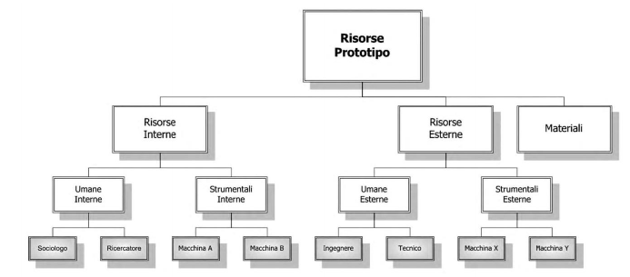
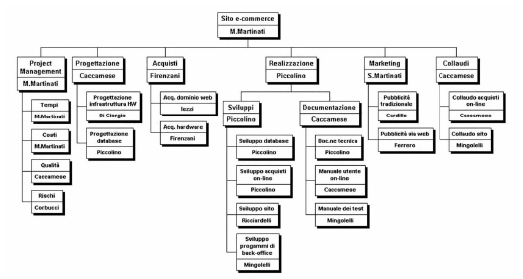
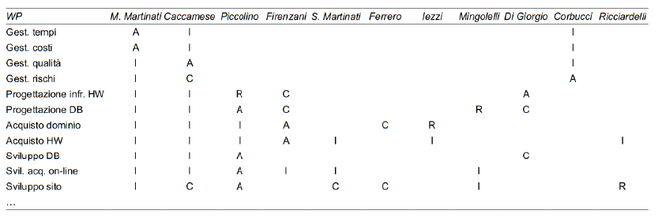
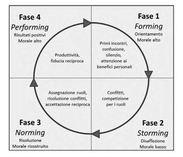
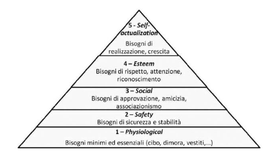

# Gestione delle risorse

## Introduzione

- **risorse**: tutto ciò che serve per portare avanti un progetto
  - umane
    - più difficili da gestire
  - strumentali (materie prime, ecc..)
- gestirle significa come acquisirle, utilizzarle e rilasciarle
- **soft skills** del PM per interfacciarsi con risorse umane
  - <u>leadership</u> - capacità di visione nel futuro
  - <u>team building</u> - capacità di costruire e consolidare il team
  - <u>motivation</u> - capacità di riconoscere e soddisfare i bisogni espliciti e impliciti degli individui
  - <u>communication</u> - capacità di trasmettere e saper ascoltare
  - <u>influencing</u> - capacità di orientare il comportamento al raggiungimento degli obbiettivi senza manipolazioni
  - <u>decision making</u> - capacità di analizzare il problema e prendere decisioni per risolverlo
  - <u>political and cultural awareness</u> - capacità di rispettare gli usi e costumi di tutti
  - <u>negotiation</u> - capacità di raggiungere un accordo, la migliore è la win-win (accontentare un po' tutti)
  - <u>trust building</u> - capacità di mantenere promesse ed impegni e non perdere la fiducia delle persone
  - <u>conflict management</u> - capacità di gestire i conflitti fra persone
  - <u>coaching</u> - capacità di stare vicino ed aiutare l'individuo ad esprimere le proprie potenzialità
- **intelligenza emotiva**
  - non si agisce solo in modo razionale
  - il PM dovrebbe cercare di capire le emozioni di una persona
  - team virtuali: barriera fisica della distanza (superata con es: videocall)
- una persona deve avere determinate doti innate per essere PM, ma alcune cose si imparano
- - <u>team</u> - persone che lavorano ad un progetto
  - il team può cambiare durante il ciclio di vita del progetto
  - il PM non sempre può scegliere i membri (dipende dall'organizzazione aziendale)
  - <u>core team</u> - team di Project Management, deve dare la rotta al progetto
  - <u>sponsor</u> - manager dell'azienda che mette a disposizione il budget

## Processi di Project Resource Management

- **pianificare la gestione delle risorse** (Plan Resource Management)
- stimare le risorse per le attività (Estimate Activity Resources)
- acquisire le risorse (Acquire Resources)
- sviluppare il gruppo di lavoro (Develop Team)

## Processo Plan Resource Management

- insieme di regole per l'acquisizione e l'uso delle risorse (Resource Management Plan)

- bisogna prevedere quali e per quanto tempo allocare le risorse

- politiche aziendali gestione personale (es: sono previsti consulenti esterni)

- **organigramma**

  - stabilire chi si occupa di cosa all'interno del progetto

  - ci possono essere persone esterne all'azienda (consulenti)

  - non segue per forza la gerarchia aziendale

    - qualcuno può essere più competente in certe aree
    - si vuole spingere una figura ad acquisire certe skills in determinati ambiti

  - <u>OBS</u> (Organization Breakdown Structure)

    - struttura ad albero in cui si denotano i ruoli aziendali (presidente, CEO, capi divisione)
    - ad ogni ruolo aziendale si assegnano le attività (WP) di cui si occupano
    - poco usato perchè:
      - ci possono essere consulenti esterni che non fanno parte dell'azienda
      - i rapporti di forza all'interno del progetto possono essere diversi da quelli aziendali
      - non si capisce bene l'organigramma del progetto

  - <u>RBS</u> (Resource Breakdown Structure)

    - non è un sottoinsieme dell'OBS

    - presenti sia risorse:

      - esterne ed interne
      - materiali e strumentali

    - un po' confusionario

      

      - sarebbe meglio distinguere tra risorse umane e materiali (PM -> ...)

  - <u>RAM</u> (Resposability Assignment Management)

    - o<u>rganizzata per WP</u>
    - si assegna ad ogni WP la risorsa responsabile (una sola) che deve rendere conto del lavoro su quel WP

    

    - solitamente si usa nella sua rappresentazione matriciale
      - righe: WP
      - colonne: persone responsabili del WP

  - <u>RACI</u>

    - evoluzione della RAM
      - **Responsible**: Responsabile operativo
      - **Accountable**: Approvatore (da l'ok, ha i soldi, executive)
      - **Consult**: persone da consultare (qualità, risorse)
      - **Inform**: persone che devono essere informate (stakeholder)
    - per uno stesso WP possono essere coinvolte più persone con ruoli diversi
    - non possono esserci più responsabili e accountable
    - forma matriciale:
      - righe: WP
      - colonne: persone
    - 

    - è la più completa tra le strutture viste fino ad ora
    - accanto alla RACI si aggiunge un documento più dettagliato con le mansioni svolte dalle varie persone

### Piano di gestione delle risorse

- descrive:
  - quando e dove scegliere le risorse (quanto tempo prima, esterno o interno)
    - troppo presto: potrebbero deteriorarsi
    - troppo tardi: potrebbero non arrivare in tempo
  - come saranno rilasciate
- complicato
- deve indicare i metodi per:
  - l’identificazione e la quantificazione delle risorse occorrenti per il lavoro del progetto;
  - definire le regole per l’acquisizione o l’ingaggio delle risorse del progetto;
  - specificare ruolo, autorità, responsabilità e competenza necessaria per ognuna delle posizioni individuate nel progetto (Roles and responsibilities);
  - definire l'organigramma del progetto (Project organization charts);
  - metodi per la gestione del team (Project team resource management);
  - la formazione tecnica del team (Training)
  - lo sviluppo del team (Team development) inerenti la creazione e il mantenimento dello spirito di squadra;
  - il controllo delle risorse fisicheprogrammazione, il reperimento e la dismissione;
  - riconoscimenti e premi (benefit ricevuti sulla base delle prestazioni)

### Team Charter

- stabilire per iscritto quali sono <u>valori e missione del team</u>
- devono essere in linea con quelli aziendali

## Processo Estimate Activity Resources

- stimare le risorse (umane e non) necessarie per ogni attività
- deve tenere conto della presenza di incertezze (gestione dei rischi)
- oltre che stabilire la durata (es: programmatore per 3 mesi uomo) bisogna tenere conto dei <u>calendari delle risorse</u> (attività che devono essere eseguite prima di assumere/acquisire una risorsa)

- tipologie di stime:
  - **bottom-up**
    - vado a vedere per ogni attività -> WP -> deliverable le risorse necessarie e tiro le somme risalendo fino alla radice
  - **top-down**
    - stabilisco tutto ciò che serve a partire dalla radice

## Processo Acquire Resources

- dopo aver stimato le risorse bisogna stabilire come acquisirle:

  - esterne
    - risorsa particolare
    - consulenze

  - interne

- il PM richiede le risorse alla parte amministrativa dell'azienda che se ne occupa nello specifico

  - le risorse vanno generalmente negoziate (specialmente se la struttura aziendale è a matrice debole)

- team virtuali

  - Pro:
    - sfruttare competenze geograficamente distribuite
    - ridurre i costi di viaggio e di trasporto
    - incrementare il lavoro da casa
    - agevolare la partecipazione a progetti anche per persone diversamente abili o con limitazioni di mobilità
  - Con:
    - soprattutto nei progetti Agile, essere tutti in presenza aiuta nelle fasi di brainstorming
    - linguaggio del corpo aiuta a capire cosa pensa una persona
  - un approccio ibrido tra i due è l'ideale

## Processo Develop Team

- dopo aver acquisito le risorse, bisogna creare e sviluppare il team
  - creare un clima di gruppo (motivazione, saper gestire conflitti)
  - training (capire se qualche risorsa ha bisogno di formazione)
  - valutare prestazioni (i benefit sono soggetti a valutazione)
- co-location - lavorare insieme nello stesso luogo fisico
- war-room - postazione dove viene presa tempestivamente qualsiasi decisione relativa al progetto
- <u>missione del PM</u>: rendere le persone del team migliori di come sono arrivate (es: certificazioni, corsi, ambiente, relazioni)
- <u>Management by Objectives</u>: più che per numero di ore lavorative, si lavora per raggiungere degli obbiettivi

### Teoria del Forming, Storming, Norming, Perfoming

- quando si crea un team si attraversano varie fasi:

  - **forming** - fase di conoscenza del team, definizione degli obbiettivi (morale molto alto)
  - **storming** - conflitti, competizione per i ruoli
  - **norming** - il PM assegna i ruoli, gestisce i conflitti, si cerca di ricostruire il morale
  - **performing** - il team può lavorare in armonia, morale alto
  - **adjourning** - disimpegno da parte del gruppo che completa il lavoro e si prepara a passare ad altro progetto.

  

### Teoria dell'aspettativa di Vroom

- il comportamento delle persone dipende dalla loro aspettativa
- la presenza di un'aspettativa indotta dal PM (soldi, realizzazione personale) permette al team di lavorare meglio

### Teoria dell'igiene di Herzberg

- fattori che condizionano la motivazione:
  - di igiene: 
    - condizione di lavoro (posto), sicurezza, stipendio
    - se negativi possono distruggere la motivazione
  - motivazionali
    - responsabilità, autorealizzazione, crescita professionali
    - cause scatenanti di un'effettiva crescita personale
- bisognerebbe cercare di passare dai primi fattori ai secondi (secondo Herzberg i primi non servono a motivare)

### Teoria dei bisogni di Maslow

- universalmente riconosciuta come giusta
- ha realizzato una piramide di 5 livelli di bisogni di una persona:
  1. **fisiologici** - bisogni minimi ed essenziali (cibo, vestiti)
  2. **sicurezza** - bisogni di sicurezza e stabilità (contratto tempo indeterminato)
  3. **sociali** - bisogni di approvazione, amicizia
  4. **stima** - bisogni di rispetto, attenzione, riconoscimento (voglia di responsabilità, gestire un gruppo)
  5. **autorealizzazione** - bisogni di realizzazione e di crescita (es: creazione di un'azienda)

- non si possono saltare dei livelli, ognuno è un prerequisito per il successivo
- *si può solo salire o anche scendere?*
  - es: imprenditore che finisce per strafa

### Teoria X e Y di McGregor

- teoria X: descrive come i manager vedono i lavoratori
- la maggior parte dei lavoratori:
  - non ama lavorare
  - manca d'ambizione
  - ha scarsa capacità creativa
  - non è propenso a risolvere problemi
- conseguenze:
  - preferiscono essere dirette ed evitano di prendere responsabilità e iniziativa;
  - sono indifferenti ai bisogni dell’organizzazione e resistenti al cambiamento;
  - sono motivati soltanto dai bisogni fisiologici e di sicurezza (i due livelli bassi della piramide di Maslow).

- teoria Y: intervista ai lavoratori
- la maggior parte delle persone:
  - raggiunge il massimo delle prestazioni se opportunamente motivato e supportato;
  - è creativo e impegnato a raggiungere gli obiettivi dell’organizzazione;
  - è autodisciplinato, può autocontrollarsi, desidera responsabilità.
- Nell’ambito del lavoro i lavoratori sono motivati soprattutto dai livelli alti della piramide di Maslow
- Teoria Z (evoluzione della Y)