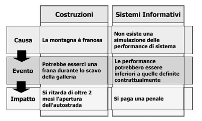
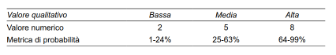
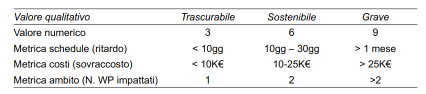
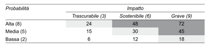
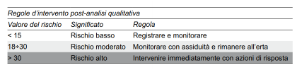
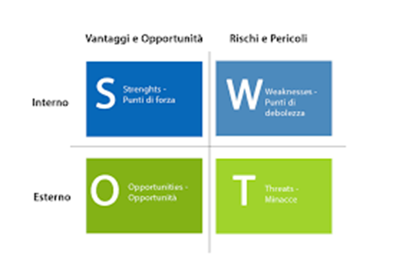
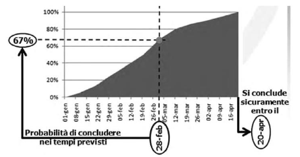
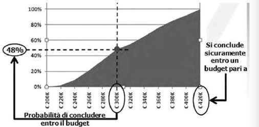
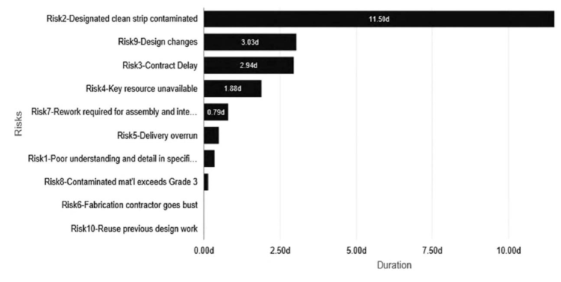
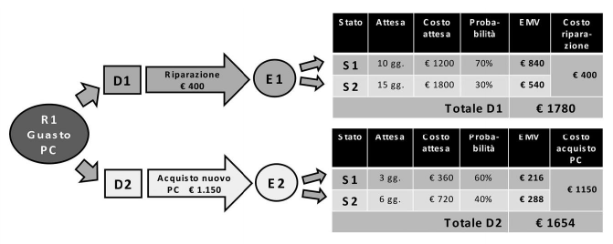

# Gestione dei rischi

## Incertezza

- si dovrebbe parlare più propriamente di **incertezza**
  - il <u>rischio</u> ha solo un'accezione negativa
  - l'<u>incertezza</u> può avere sia riscontri positivi (*opportunity*) che negativi (*threat*)
- qualsiasi progetto è esposto ad incertezza
  - bisogna sia prevedere i rischi che reagire prontamente ad essi
  - quando capita qualcosa che non va potrebbe finire più tardi o saltare qualche obbiettivo
  - quasi sempre però ci sono incertezze positive che bisogna cogliere (opportunità)
  - bisognerebbe vedere delle opportunità in ogni cambiamento
- possono essere
  - prevedibili (*known*)
    - bisogna essere proattivi
    - riserve di contingenza
  - non note (*unknown*)
    - bisogna essere reattivi (rispondere prontamente)
- la gestione dei rischi di progetto (Project Risk Management) consiste nel processo sistematico di identificazione, analisi e risposta ai rischi di progetto

- grandezze fondamentali

  - probabilità
    - può dipendere dal periodo
  - impatto
    - conseguenze sul progetto
    - può impattare
      - ambito
      - tempi
      - costi
      - qualità

- bisogna distinguere

  - <u>causa</u> - condizione, stato o fatto certo
  - <u>evento</u> - probabilità di verificarsi
  - <u>impatto</u> - sugli obbietivi del progetto

  - per prevenire rischi bisogna agire sulle cause
  - agire sull'evento significa reagire ad esso

- <u>rischi vs questioni</u>

  - rischio
    - evento incerto
    - risposta proattiva
  - questione (*issue*)
    - problema, criticità effettiva
    - risposta reattiva

- tipologie di rischio

  - singolo
    - incertezza che si verifichi un singolo evento
    - es: rischio di una frana
  - generale (globale)
    - riguarda il progetto nel suo insieme
    - insieme di tutti i rischi
    - studio complicato (non tutti i rischi si verificano, solo alcuni sono negativi) -> metodo MonteCarlo

- fattore culturale

  - a livello di:
    - popolo
      - neolatini -> rischio = minaccia
      - anglosassoni -> rischi = oppportunità
    - persona
      - <u>propensione al rischio</u> (fattore psicologico)
        - *risk averse* - avversi a qualsiasi rischio
        - *risk seeker* - assunzione di grandi rischi per ottenere il massimo vantaggio
        - *risk neutral* - rischi nel breve termine per vantaggi a lungo termine
        - *risk tolerant* - focalizzati sulla pura consapevolezza del rischio, senza alcuna gestione dello stesso
      - <u>tolleranza al rischio</u> (massima esposizione al rischio che un individuo / organizzazione può far fronte senza ripercussioni)
      - <u>soglia di rischio</u> (livello sopra il quale non si è disposti ad accettare un rischio)

- possibilità di richiedere consulenze di esperti per valutare i rischi

- emergent risk (unknown-unkowns)

  - incertezze delle quali ci si può rendere conto solo quando si presentano
  - stanziamento riserve di contingenza

### Resilienza

- capacità di resistere ad un evento avverso
- più riserve si stanziano, più il progetto è resiliente

## Processi di Risk Management

- Pianificare la gestione dei rischi (Plan Risk Management): definire le linee guida e le regole per le attività di gestione dei rischi del progetto.
- Identificare i rischi (Identify Risks): determinare i rischi (sia opportunità che minacce) e documentare le loro caratteristiche.
- Eseguire l’analisi qualitativa dei rischi (Perform Qualitative Risk Analysis): assegnare un indice qualitativo ai rischi identificati
  che consenta di individuare le priorità nella loro gestione.
- Eseguire l’analisi quantitativa dei rischi (Perform Quantitative Risk Analysis): analizzare numericamente l’esposizione
  complessiva del progetto al rischio.
- Pianificare le risposte ai rischi (Plan Risk Responses): sviluppare il piano delle azioni di risposta ai rischi, necessarie per incrementare le opportunità e per ridurre le minacce del progetto.
- Eseguire le risposte ai rischi (Implement Risk Responses): garantire che le azioni di risposta ai rischi siano poste in essere come pianificato.
- Monitorare i rischi (Monitor Risks): valutare l’efficacia del piano di risposta ai rischi, rilevare lo stato dei rischi e identificare
  nuovi rischi.

## Processo Plan Risk Management

- pianificazione dei rischi
  - decisione del tipo di approccio ai rischi
    - specialmente dello sponsor del progetto
    - approccio più o meno tollerante
- **piano di gestione dei rischi** (*Risk Management Plan*)
  - <u>strategia</u> - approccio di gestione dei rischi
  - <u>metodologia</u> - strumenti e dati da usare nella valutazione
  - <u>ruoli e responsabilità</u> - ogni rischio deve avere dei responsabili
  - <u>budget</u>
  - <u>riserve</u> - di contingenza e di gestione
  - <u>tempistica</u>
  - <u>categorie di rischio</u> - tecnici, dell'organizzazione, ambientali, politici, di Project Management
  - <u>propensione al rischio degli stakeholder</u>
  - <u>scala della probabilità e dell'impatto dei rischi</u>
  - <u>matrice di probabilità ed impatto</u>
  - <u>formati di reporting</u>
  - <u>registrazione</u> - verbale che registra il modo in cui si sono gestiti i rischi

### Scala di probabilità e scala di impatto dei rischi

- i rischi possono essere di varia natura (software, hardware, tecnici, del personale)

- serve un metodo per uniformare la gestione dei rischi

  - si associa ad ogni rischio un <u>giudizio</u> (basso-medio-alto)
    - ad ogni giudizio si assegna 
      - un <u>numero</u> (0 - 10)
      - una <u>probabilità</u> che occorra

  

  - si ripetono le stesse operazioni per <u>l'impatto</u>

  

  - i valori numerici nei due casi sono differenti (sto dando più peso all'impatto)

  - **matrice di probabilità-impatto**

    - righe: probabilità
    - colonne: impatto
    - intersezione: probabilità * impatto

    

    - i valori dividono la matrice in zone (grigio chiaro-scuro)

      - grigio scuro - rischi più pericolosi / opportunità migliori
      - grigio chiaro - rischi piccoli / peggiori opportunità

    - in base al valore si definiscono delle politiche di gestione:

      

## Processo Identify Risks

- non esistono regole precise su come identificare i rischi
- simile all'analisi dei requisiti di un software
  - riunione con stakeholder
  - call con esperti
  - lesson learned
  - stime passate
  - registro stakeholder
    - informazioni su ognuno di essi
  - piani di gestione dei requisiti, dei costi, della schedulazione, delle risorse 
  - eventuali documenti contrattuali (es: penali)
- alcuni rischi possono diminuire nel tempo, altri aumentare
- **tecniche di raccolta dati**
  - brainstorming
  - checklist
  - interviste
- **tecniche di analisi dei dati**
  - analisi delle cause originarie (*Root Cause Identification*)
    - considerando le cause più importanti ho risolto la maggior parte dei rischi (regola 80-20)
  - analisi degli assunti e dei vincoli
  - <u>analisi SWOT</u>
  - analisi dei documenti
    - es: leggi, norme per prevenire rischi

- <u>analisi SWOT</u> (*Strenghts, Weaknesses, Opportunities and Threats*)

  - nasce da una matrice 2x2

    - righe: tipologia di cause
      - interne - dipendono dal mio gruppo
      - esterne - non dipendono da me
    - colonne:
      - cose positive (vantaggi e opportunità)
      - cose negative (rischi e pericoli)

    

  - metodologia

    - analisi dei punti di forza, rispetto al team e ai singoli componenti, rispetto al progetto, rispetto al prodotto/servizio che si deve realizzare, rispetto al cliente e in genere al contesto in cui si opera
    - analisi dei punti di debolezza rispetto alle stesse variabili sopra riportate
    - identificazione delle opportunità (rischi positivi) a partire dai punti di forza evidenziati
    - identificazione delle minacce (rischi negativi) a partire dai punti di debolezza evidenziati

- le tipologie di rischi da individuare sono noti generalmente
  - uso di prompt list (check list) per controllare i rischi più diffusi

### Registro dei rischi

- una volta identificati i rischi si deve compilare il registro dei rischi
  - elenco dei rischi identificati
  - elenco dei potenziali responsabili della gestione dei rischi identificati
  - elenco delle potenziali risposte ai rischi, dove possibile

## Processo Perform Qualitative Risk Analysis

- due processi di analisi:
  - qualitative (questo)
    - legato ai singoli rischi
  - quantitative
    - legato al rischio globale
- le decisioni devono essere sempre prese in base all'attitudine del rischio degli stakeholder / sponsor
- influenza della valutazione
  - sovradimensionamento (bias)
    - rischi che ci riguardano personalmente
    - rischi molto vicini nel tempo
    - rischi riguardanti i bambini
  - sottodimensionamento
    - rischi che non ci riguardano direttamente
- raggruppamento rischi
  - RBS (Risk Breakdown Structure)
    - albero che suddivide i rischi in base a categorie e sottocategorie

### Analisi dei dati

- il valutatore dei rischi dovrebbe usare tutti i dati a disposizione
- parametri
  - **urgenza** - anticipo minimo occorrente affinchè una risposta al rischio sia efficace
  - **prossimità** - tempo che occorre perché il rischio sviluppi il suo impatto
  - **quiescenza** - periodo di tempo occorrente tra il verificarsi del rischio e la scoperta del suo impatto
  - **gestibilità** - facilità con la quale il verificarsi del rischio e il suo impatto possono essere gestiti
  - **controllabilità** - grado con il quale si può tenere sotto controllo l'impatto del rischio
    - alcuni rischi si possono solo tenere sotto controllo, non evitare del tutto
  - **identificabilità** - facilità con la quale è possibile riconoscere il verificarsi dell'impatto di un rischio
    - posso non accorgermi di alcuni rischi
  - **connettività** - livello al quale il rischio è conesso ad altri rischi singoli
  - **impatto strategico** - livello al quale l'impatto del rischio tocca gli obbiettivi strategici dell'organizzazione
  - **propinquità** - livello di importanza del rischio percepito dagli stakeholder

### Valutazione della probabilità e dell'impatto dei rischi

- l'impatto si può avere su:
  - ambito
  - tempi
  - costi
  - qualità
- se ho impatti diversi si tende a considerare il massimo
- il valore del rischio complessivo si ottiene come prodotto probabilità * impatto
  - in alcuni casi si considera una media pesata
  - si può dare più peso all'impatto ad esempio
- ottenuti i valori, si può stilare la prioritizzazione
  - classificare i rischi in ordine di gravità descrescente
  - si fa sia per opportunità, che per minacce
  - si stila la matrice probabilità-impatto (o utilizzare un piano cartesiano)

## Processo Perform Quantitative Risk Analysis

- riguarda i rischi globali (insieme dei rischi che possono capitare)
- se i rischi fossero tutti indipendenti l'uno dall'altro basterebbe fare la somma delle singole probabilità
  - purtroppo molti sono correlati
  - o ci sono delle causalità (l'avvenire di un rischio provoca l'avvenimento di un altro)
  - l'analisi diventa quindi complicata
  - se accadono più rischi contemporaneamente, la gestione diventa complessa
- <u>tecniche di analisi</u>
  - <u>simulazione</u> (*Simulation* o Analisi Monte Carlo)
    - costruire un modello
    - si fanno accadere i rischi in maniera random (secondo le probabilità decise)
    - si effettua un certo numero di simulazioni
    - si raccolgono dati su costi e tempi che avrei nei casi simulati
    - si valuta la distribuzione ottenuta
  - <u>analisi di sensitività</u> (*Sensitivity Analysis*)
  - <u>analisi del valore monetario atteso</u> (*EMV Analysis*)
  - <u>analisi dell'albero delle decisioni</u> (*Decision Tree*)
  - <u>diagrammi di influenza</u> (*Influence Diagram*)

### Simulazione: l'analisi Monte Carlo

- si usa un simulatore per simulare i rischi
- si ottengono dati su costi e tempi che otterrei
- decido quali rischi prendere in base alla distribuzione ottenuta

- si ottengono dati su:

  - probabilità di terminare il progetto, entro gli obiettivi di tempo;
  - probabilità di completare una parte del progetto, o una qualsiasi milestone entro la data attesa;
  - probabilità di completare il progetto entro il budget assegnato;
  - data entro la quale c’è la garanzia totale (o entro una soglia di tolleranza espressa in percentile) che il progetto termini;
  - budget che dà la garanzia totale (o entro una soglia di tolleranza espressa in percentile) di spesa sul progetto;
  - probabilità di completare il progetto entro la data scaturita dall’analisi deterministica tipica del CPM (Critical Path Method) o entro la data attesa dal cliente.
    - critical path: percorso in cui non posso prevedere ritardi
    - se ho un ritardo si ripercuoterà su tutto il progetto

- si creano due grafici: uno sui tempi ed uno sui costi

  

  

- <u>difetto</u> - è costosa (a livello di tempo, elaborazione delle iterazioni)
- nell'analisi è utile determinare quali attività si trovano nel percorso critico
  - bisogna concentrare maggiori sforzi in quelle attività

### Analisi di sensitività

- analisi della correlazione dei rischi
  - più lo sono, più l'avvenimento di un rischio avrà un impatto maggiore

- *tornado diagram* - rischi con maggiore impatto
  - solitamente si effettua la valutazione sulle cause (in ordinata), non sui rischi
  - rapporto cause-rischi -> rapporto power-low
    - poche cause possono comportare tanti rischi (es: terremoto)
    - bisogna agire sulle cause che provocano più rischi (soprattutto se correlati tra loro)

### Analisi del valore monetario atteso

- $EMV=P*I$
  - P -> probabilità di accadimento
  - I ->  valore economico del danno provocato
- EMV applicato alle minacce -> determinazione riserva di contingenza

### Albero delle decisioni (*Decision Tree*)

- si usa per supportare le decisioni
- si considerano:
  - nodi - eventi che possono capitare
  - archi - soluzioni possibili con relativi costi

- **problema** - sono complicati
  - bisogna stimare precisamente le probabilità

## Processo Plan Risk Responses

- progettazione delle risposte al rischio
- risposte
  - proattive
    - tecniche atte a prevenire il rischio
  - reattive
    - se il rischio diventa issue lo gestisco subito
- le azioni ai rischi devono essere:
  - appropriate alla severità del rischio;
  - economicamente efficaci;
  - programmate nei momenti opportuni;
  - realistiche;
  -  assegnate e gestite da un unico responsabile;
  - note a tutte le parti coinvolte.

- Le strategie atte a rispondere ai rischi singoli 
  - negativi (minacce)
    - evitare (Avoid)
    - trasferire (Transfer);
    - mitigare (Mitigate).
  - positivi (opportunità)
    - procedere all’escalation (Escalate);
    - sfruttare (Exploit);
    - condividere (Share);
    - potenziare (Enhance).
  - sia negativi che positivi
    - accettare (Accept)
- **strategie di risposta contingenti**
  - messe in atto solo se si verificano determinate condizioni predefinite (casi di rischi noti)
  - azioni di tipo reattivo pianificate in anticipo in modo proattivo
  - per rischi unknown -> riserva di gestione
- **escalation**
  - in caso di minaccia di natura tale da essere fuori dal dominio del PM
  - le azioni richiedono un'autorità superiore
  - cambio di responsabilità del rischio

### Evitare la minaccia

- eliminare le condizioni che portano al verificarsi del rischio
- adatta a rischi ad alta severità
- strategie
  - modificare la strategia del progetto;
  - intervenire sulla causa della minaccia, eliminandola;
  - ridurre l’ambito del progetto eliminando la necessità di attività che generano il rischio;
  - aumentare il numero delle risorse;
  - aumentare il tempo a disposizione del progetto;
  - adottare una metodologia o una tecnologia nota anziché innovativa;
  - evitare fornitori o subappaltatori poco conosciuti;
  - ottenere informazioni aggiuntive;
    acquisire competenze mancanti.

### Trasferire la minaccia (*Transfer*)

- si paga un piccolo prezzo per attutire un grande problema
- esempi
  - polizze assicurative (Insurance);
  - garanzie (Warranties);
  - fideiussioni (Performance Bonds) – obbligazioni da parte di un garante da indennizzare in caso di mancata esecuzione degli obblighi contrattuali;
  - contratti a prezzo fisso (Fixed Price Contract) – per trasferire integralmente il rischio al venditore/fornitore;
  - contratti a prezzo variabile (Cost-Plus Contract) – per trasferire parzialmente il rischio di extra costo al venditore/fornitore.

### Mitigare la minaccia (*Mitigate*)

- accetto il fatto che potrebbe accadere qualcosa e me ne assumo la responsabilità

### Procedere all'escalation per le opportunità (*Escalation*)

- potrei non essere in grado di gestire l'opportunità, per questo si effettua l'escalation

### Sfruttare l'opportunità (*Exploit*)

- determinare le condizioni che portino al verificarsi certo di un’opportunità

### Condividere l'opportunità

- equivalente dell'assicurazione
- condivisione della responsabilità di un’opportunità con un
  soggetto terzo che abbia maggiori capacità di raggiungerla
- esempi:
  -  joint venture
  - partnership industriali o commerciali

### Potenziare l'opportunità

### Accettare il rischio

- accettazione
  - attiva -> metto la contingenza
  - passiva -> non prevedo la contingenza

### Strategie di risposta al rischio

### Riserve

- nella riserva di contingenza non si fa la somma di tutti i rischi
  - molti sono connessi tra loro
  - non si verificheranno tutti
- si esegue l'analisi Monte Carlo e ci si assesta intorno all'80%
- 10% budget -> riserva contingenza

